# Analytics — Risposte agli Inviti

**Analisi delle risposte ricevute agli inviti per la compilazione del questionario sull'adozione del Federated Learning negli Ospedali Italiani**

> Questa pagina presenta l'analisi degli inviti inviati e delle risposte ricevute da parte dei referenti ospedalieri contattati. Per l'analisi delle risposte al questionario vero e proprio (contenuto delle domande), si veda la sezione dedicata (in fase di sviluppo).

---

## Dashboard KPI

Riepilogo sintetico dei principali indicatori relativi alla campagna di inviti.

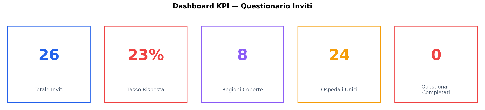

| KPI | Valore |
|-----|--------|
| Totale inviti inviati | 26 |
| Tasso di risposta | 23% (6/26) |
| Regioni coperte | 8 su 20 |
| Ospedali unici contattati | 22 |
| Questionari completati | 0 |

---

## 1. Tasso di Risposta

Su 26 inviti inviati, solo il 23% ha generato una qualsiasi forma di risposta. Il restante 77% non ha mai risposto.

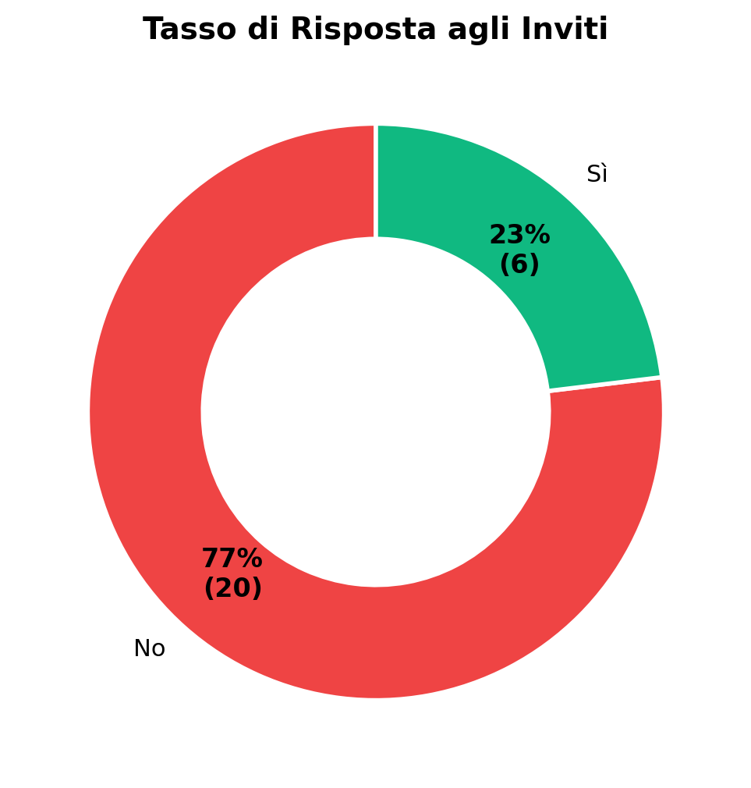

---

## 2. Stato di Engagement Dettagliato

Tra i 6 rispondenti, nessuno ha completato l'intero percorso fino alla compilazione del questionario. Le risposte si distribuiscono in diverse fasi di engagement, dalla semplice risposta iniziale fino all'appuntamento fissato ma non onorato.

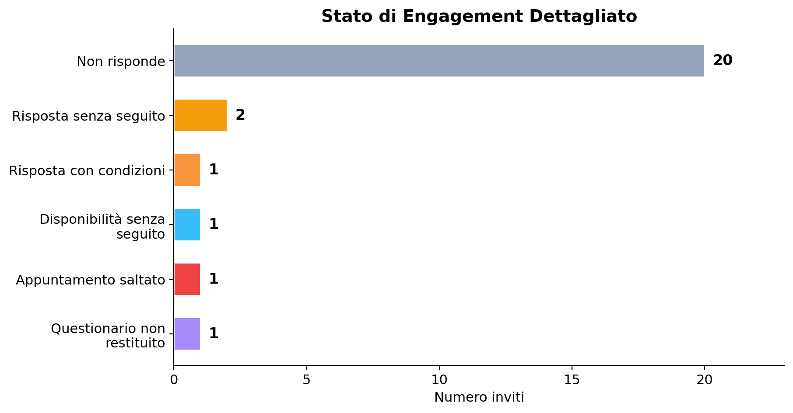

| Stato | Conteggio | Descrizione |
|-------|-----------|-------------|
| Non risponde | 20 | Nessuna risposta ricevuta |
| Risposta senza seguito | 2 | Ha risposto all'invito ma non ha dato seguito |
| Risposta con condizioni | 1 | Ha posto prerequisiti o condizioni iniziali |
| Disponibilità senza seguito | 1 | Ha fornito disponibilità ma non si è presentato |
| Appuntamento saltato | 1 | Appuntamenti fissati ma andati a vuoto |
| Questionario non restituito | 1 | Ha richiesto il questionario via mail ma non lo ha restituito |

---

## 3. Funnel di Conversione

Il funnel mostra la progressiva riduzione dei contatti lungo le fasi del processo: dall'invio dell'invito fino al completamento del questionario.

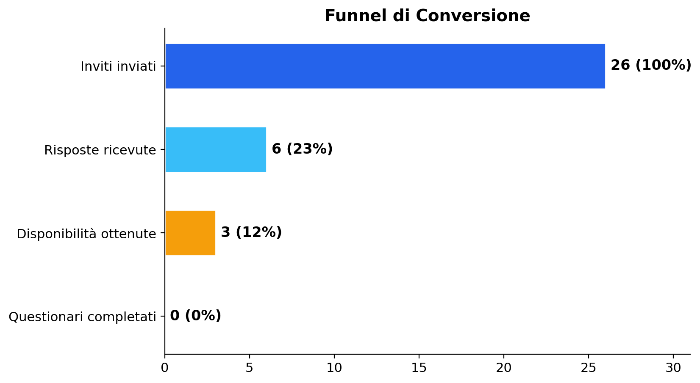

Il tasso di conversione complessivo (invito → questionario completato) è attualmente **0%**. La perdita maggiore avviene già nella prima fase (invito → risposta), con il 77% dei contatti che non risponde.

---

## 4. Distribuzione Geografica

Gli inviti coprono 8 regioni italiane, con una forte concentrazione nel **Lazio** (9 inviti, 35% del totale), seguito da **Lombardia** e **Campania** (4 inviti ciascuna).

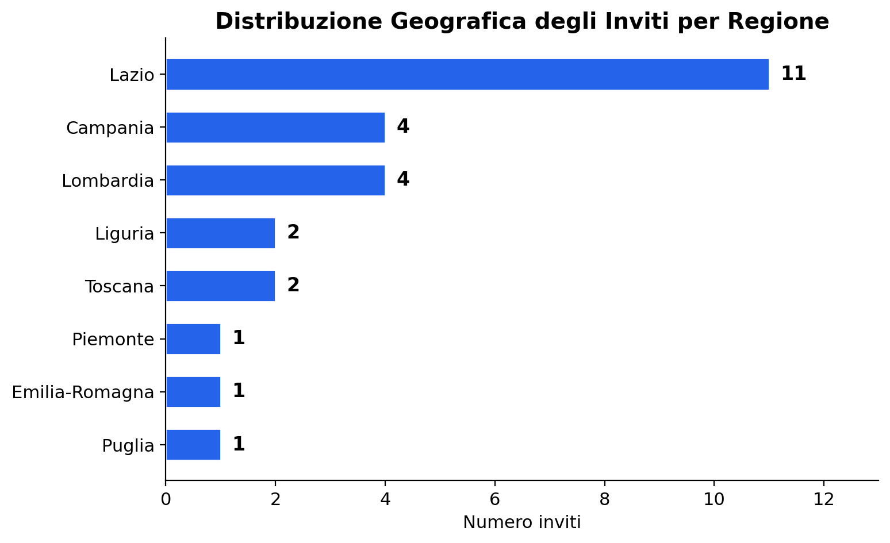

---

## 5. Regione × Stato Risposta

Il Lazio, pur essendo la regione più contattata, ha anche il maggior numero di non rispondenti. Le risposte positive provengono da regioni diverse, senza un pattern geografico evidente.

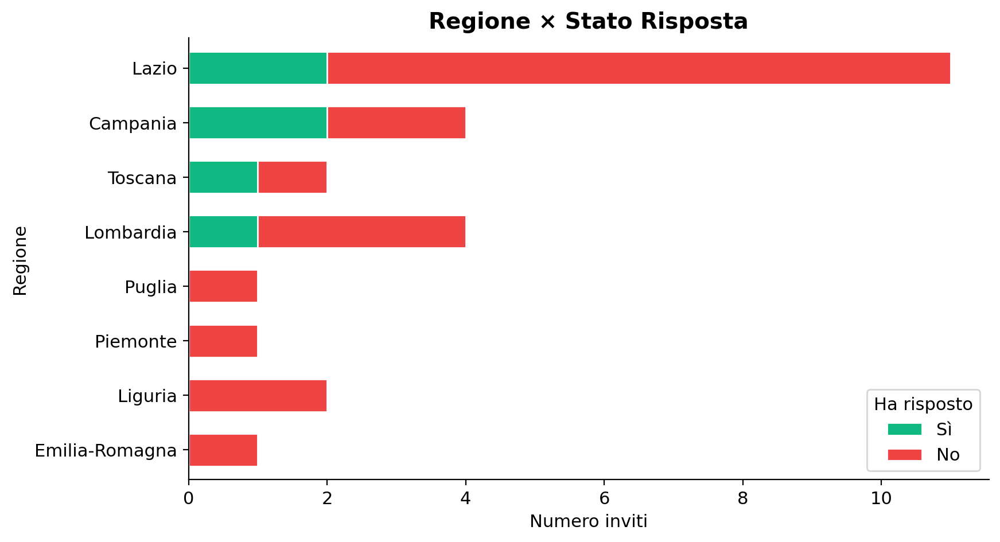

---

## 6. Tipologia di Ente

La distribuzione per natura giuridica dell'ente mostra una prevalenza di **Aziende Ospedaliere** e **Fondazioni/IRCCS** (6 ciascuna), seguite da **IRCCS** puri (4) e **Aziende Ospedaliero-Universitarie** (3).

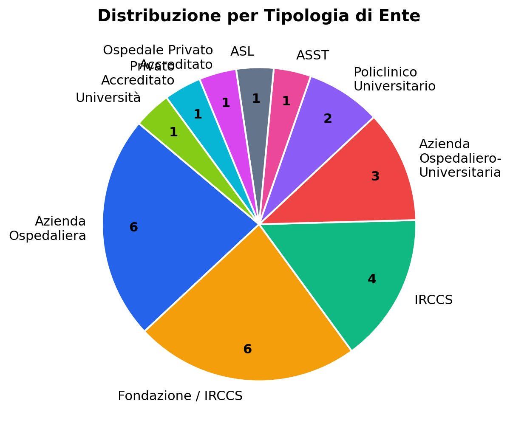

---

## 7. Tipologia Ente × Stato Risposta

Le risposte provengono in modo trasversale da diverse tipologie di ente. Non si osserva una tipologia significativamente più reattiva delle altre, anche se le Fondazioni/IRCCS hanno generato più risposte in termini assoluti.

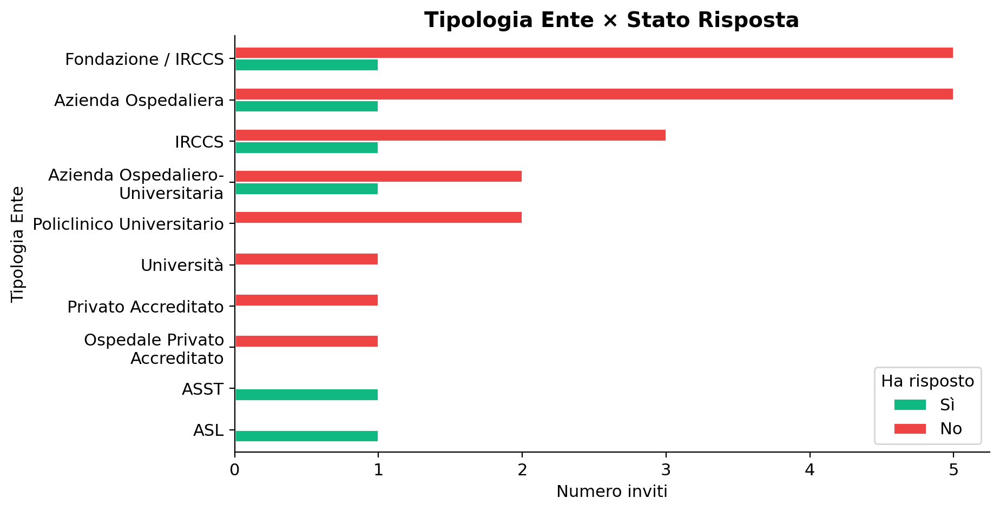

---

## 8. Dimensione Ospedale × Stato Risposta

La grande maggioranza degli inviti è stata indirizzata a strutture di **grandi dimensioni** (21/26). Le poche risposte ricevute provengono esclusivamente da ospedali grandi.

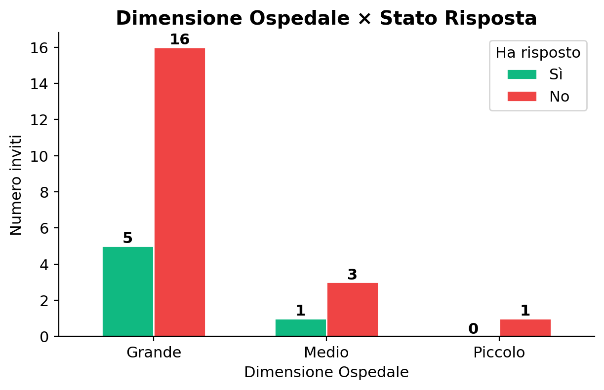

| Dimensione | Inviti | Risposte | Tasso |
|------------|--------|----------|-------|
| Grande | 21 | 5 | 24% |
| Medio | 4 | 1 | 25% |
| Piccolo | 1 | 0 | 0% |

---

## 9. Distribuzione per Macro-ruolo

Il profilo prevalente tra i contattati è quello **IT / CIO / Sistemi Informativi** (58%), coerente con il target del questionario. Seguono i profili di **Top Management / Direzione Generale** (23%).

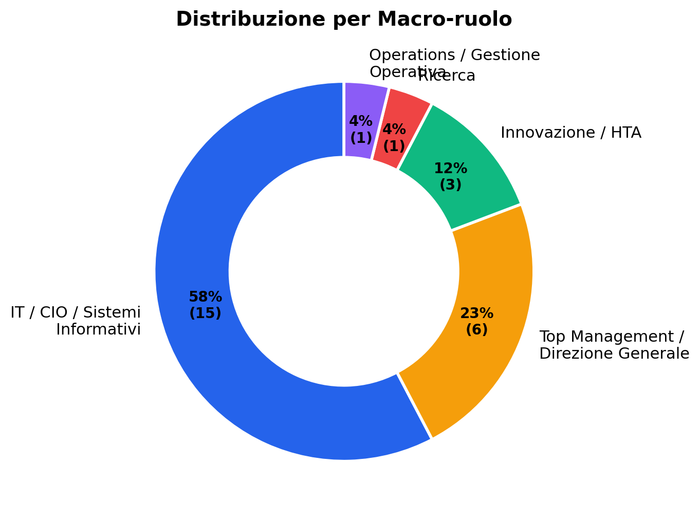

---

## 10. Macro-ruolo × Stato di Engagement

La heatmap evidenzia come la quasi totalità dei non rispondenti appartenga al profilo IT/CIO. Le risposte più articolate (disponibilità, condizioni) provengono da profili diversificati.

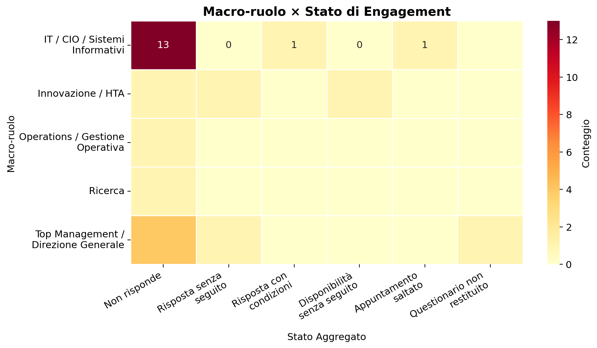

---

## 11. Canale di Invito

Il canale prevalente è **LinkedIn** (96%), con un solo invito inviato via **Mail**. Questo riflette la strategia di contatto adottata nella fase iniziale.

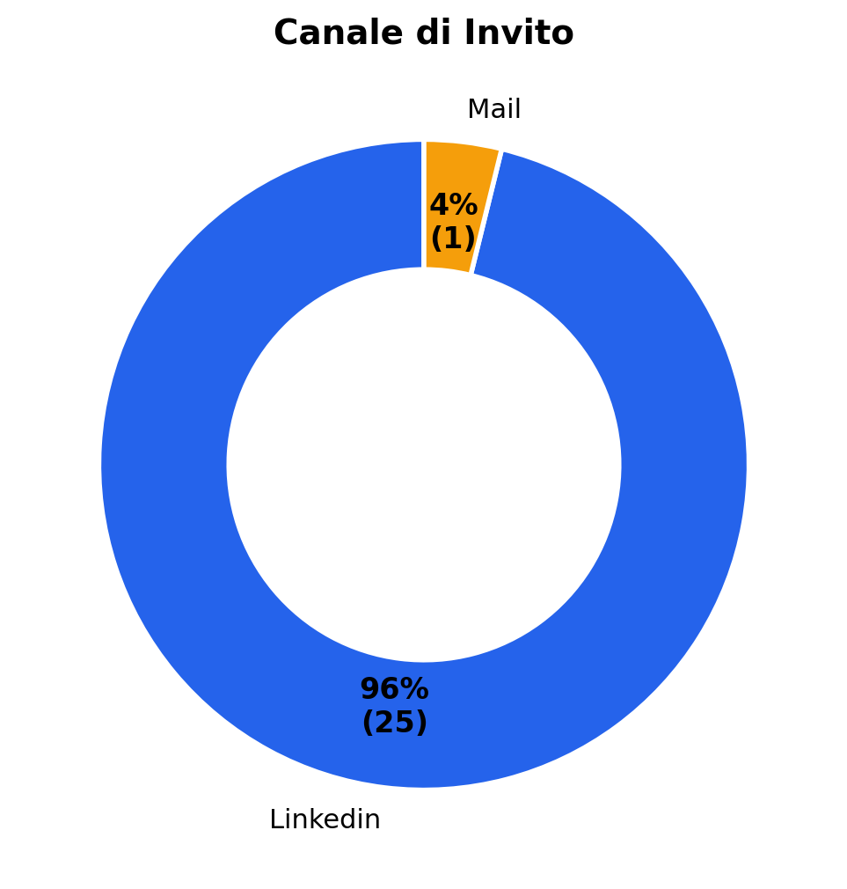

---

## 12. Canale di Invito × Stato Risposta

Il confronto tra canali è poco significativo dato lo sbilanciamento (25 LinkedIn vs 1 Mail). Entrambi i canali registrano una bassa percentuale di risposta.

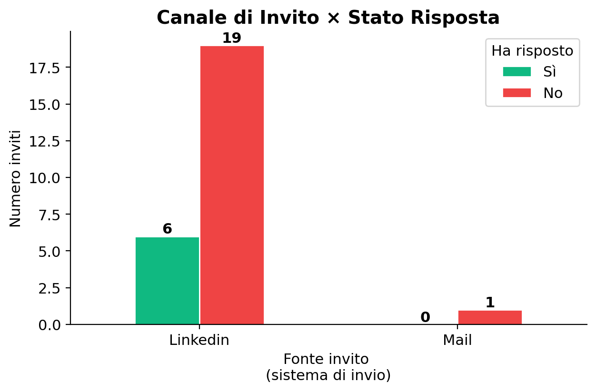

---

## 13. Analisi Temporale

Gli inviti sono stati inviati tra **giugno e agosto 2025**, con un picco di invii concentrato nella settimana del 25 giugno. Le risposte si sono distribuite nei giorni immediatamente successivi ai rispettivi inviti.

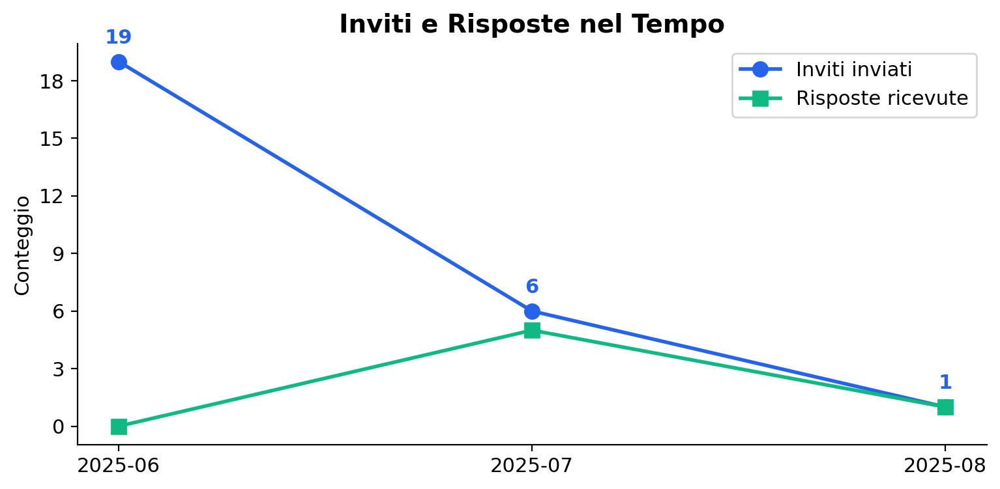

---

## 14. Elenco Ospedali — Tipologia e Dimensione

Tabella riepilogativa di tutti gli ospedali contattati, classificati per regione, tipologia di ente e dimensione.

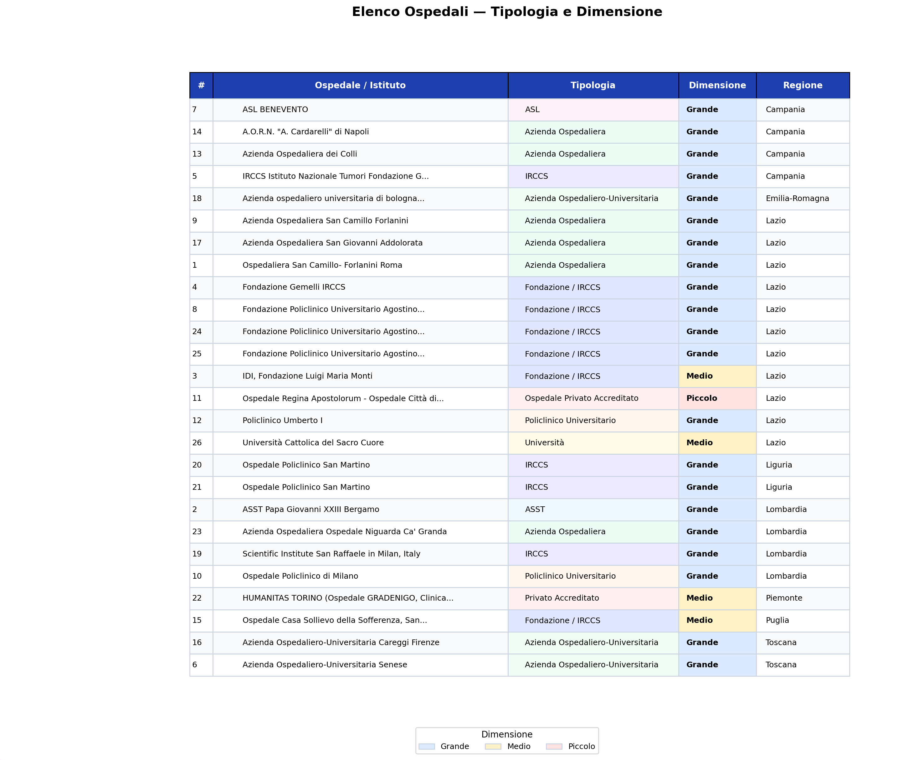

---

## Considerazioni

- **Tasso di risposta molto basso (23%):** la maggior parte dei contatti non ha risposto; nessun questionario è stato completato
- **Concentrazione geografica:** il 35% degli inviti è diretto al Lazio, mentre 12 regioni italiane non sono state raggiunte
- **Profilo IT predominante:** il 58% dei contattati ha un ruolo IT/CIO, coerente con il target ma potenzialmente limitante per la diversificazione delle prospettive
- **Canale unico:** la quasi totale dipendenza da LinkedIn suggerisce l'opportunità di diversificare i canali di contatto (mail istituzionale, telefono, referral)
- **Strutture grandi:** il campione è sbilanciato verso ospedali di grandi dimensioni, sottorappresentando le realtà medio-piccole

---

[← Torna al README principale](README.md)
