# Analytics — Struttura del Questionario

**Analisi della struttura del questionario sull'adozione del Federated Learning negli Ospedali Italiani**

> Questa pagina analizza la composizione e l'architettura del questionario (34 domande, 3 sezioni, 16 temi). Per l'analisi delle risposte ricevute agli inviti, si veda la pagina [Analytics Inviti](ANALYTICS_INVITI.md).

---

## Dashboard KPI

Riepilogo sintetico della struttura del questionario.

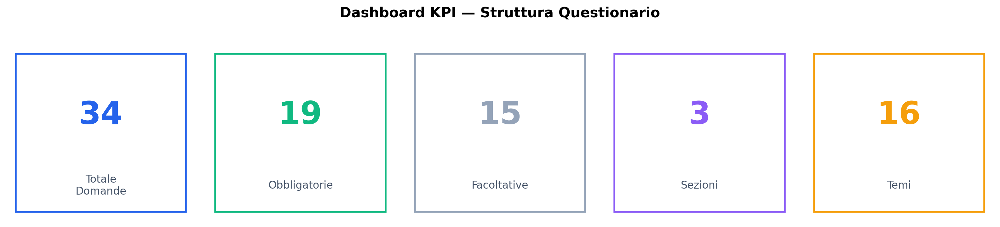

| KPI | Valore |
|-----|--------|
| Totale domande | 34 |
| Obbligatorie | 19 (56%) |
| Facoltative | 15 (44%) |
| Sezioni | 3 (A, B, C) |
| Temi tematici | 16 |

---

## 1. Distribuzione Domande per Sezione

Il questionario è suddiviso in 3 sezioni. La **Sezione A** (Consapevolezza e Adozione) contiene il maggior numero di domande (13), seguita dalla **Sezione B** (Sfide, Privacy, Sicurezza, Tecnologia) con 11 e dalla **Sezione C** (Valutazione, Barriere, Futuro) con 10.

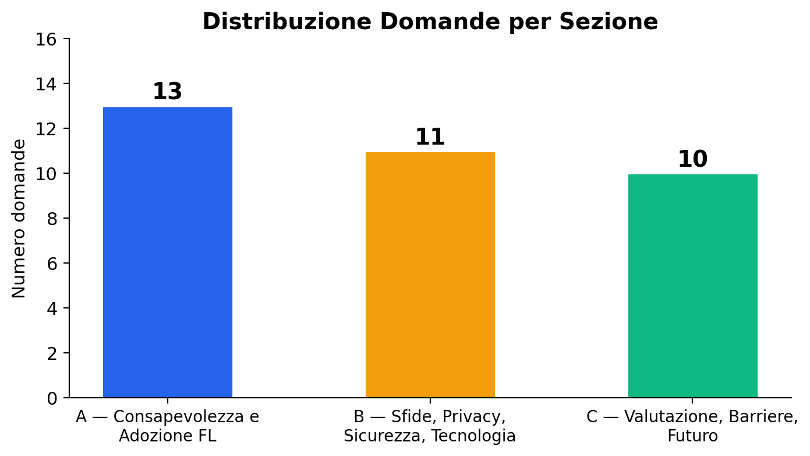

| Sezione | Argomento | Domande |
|---------|-----------|---------|
| **A** | Consapevolezza e Adozione FL | 13 |
| **B** | Sfide, Privacy, Sicurezza, Tecnologia | 11 |
| **C** | Valutazione Successo, Barriere, Futuro | 10 |

---

## 2. Domande Obbligatorie vs Facoltative

Il 56% delle domande è obbligatorio (19/34), garantendo un nucleo minimo di informazioni raccolte da ogni rispondente. Le 15 domande facoltative servono come approfondimento per i rispondenti più disponibili.

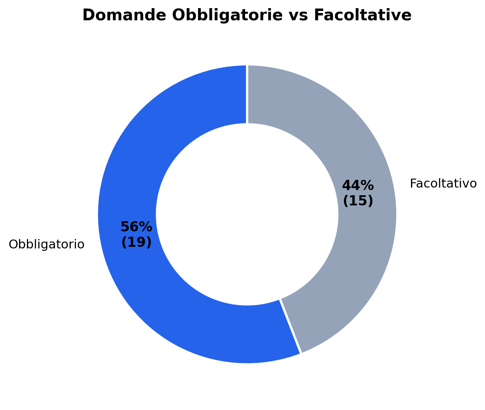

---

## 3. Tipologia di Risposta

Le domande si distribuiscono in tre tipologie: **aperte** (risposta libera), **chiuse** (scelta multipla) e **miste** (aperta/chiusa, con opzione "Altro"). La prevalenza di domande aperte (47%) riflette la natura esplorativa della ricerca.

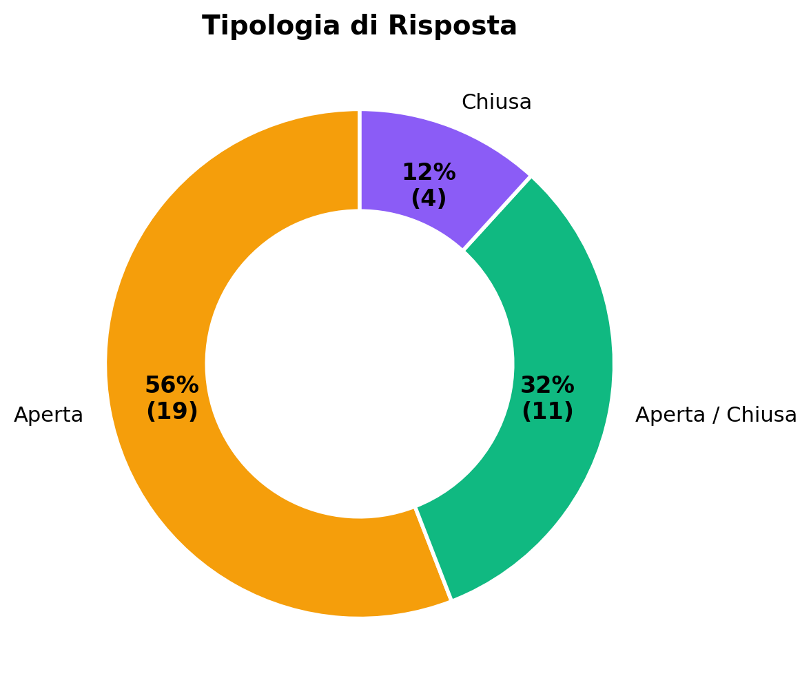

| Tipo | Conteggio | % |
|------|-----------|---|
| Aperta | 16 | 47% |
| Aperta / Chiusa | 9 | 26% |
| Chiusa | 9 | 26% |

---

## 4. Sezione × Obbligatorio / Facoltativo

La Sezione A ha un equilibrio tra domande obbligatorie (6) e facoltative (7), perché molte domande di approfondimento (2b, 4b, 5b, 5c) sono facoltative. Le Sezioni B e C hanno una prevalenza di domande obbligatorie.

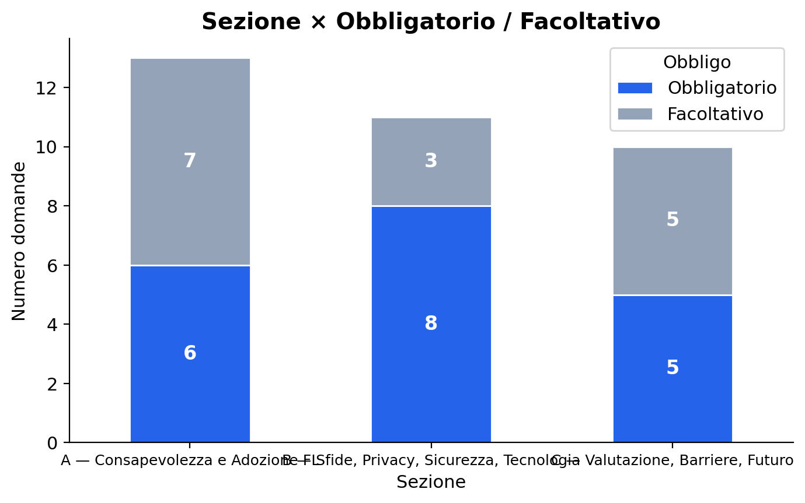

---

## 5. Sezione × Tipologia di Risposta

La Sezione A è la più eterogenea, con un mix di domande aperte, chiuse e miste. La Sezione B privilegia le domande aperte e miste (tecnologia e infrastruttura richiedono descrizioni dettagliate). La Sezione C è prevalentemente aperta, coerente con la natura valutativa e prospettica delle domande.

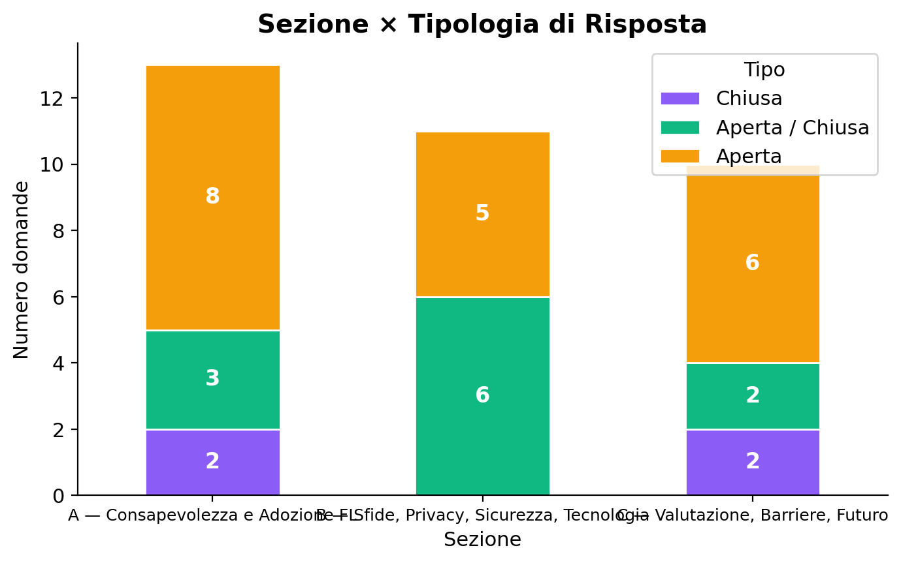

---

## 6. Distribuzione Domande per Tema

I temi con il maggior numero di domande sono **Valutazione successo** (6 domande, Sezione C), **Tecnologica** (5 domande, Sezione B) e **Sfide** (4 domande, Sezione A). Questo riflette la profondità di analisi richiesta su questi argomenti chiave.

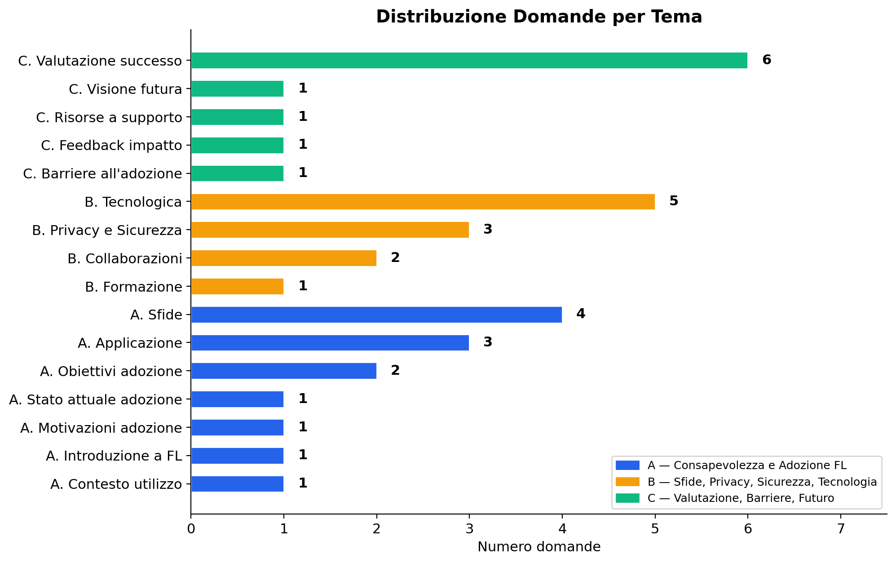

---

## 7. Tema × Tipologia di Risposta

La heatmap evidenzia come i temi più tecnici (Tecnologica, Sfide) combinino domande aperte e chiuse, mentre i temi valutativi (Valutazione successo, Visione futura, Barriere) siano prevalentemente aperti.

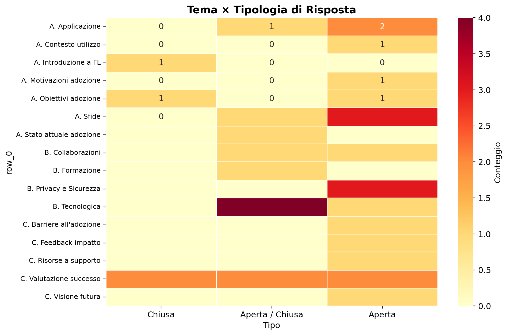

---

## 8. Tema × Obbligatorio / Facoltativo

I temi con più domande facoltative sono quelli che prevedono approfondimenti progressivi (Sfide, Privacy e Sicurezza, Valutazione successo). I temi con una sola domanda sono tutti obbligatori, a garanzia della copertura tematica minima.

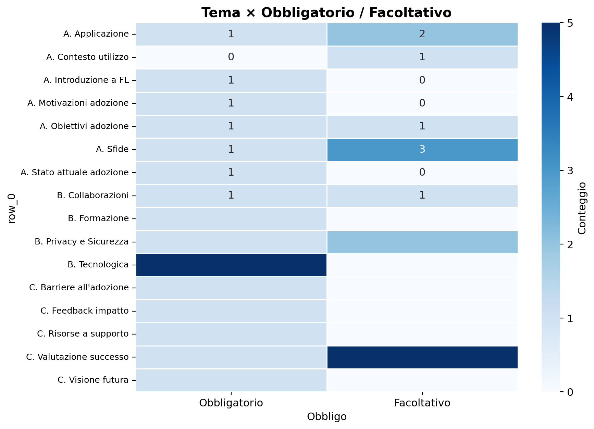

---

## 9. Domande Principali vs Approfondimento

Su 34 domande, 15 sono domande principali (numerate 1–15) e 19 sono domande di approfondimento (suffisso b/c/d/e/f). Questo schema "a imbuto" consente di ottenere risposte sintetiche dalle domande principali e dettagli aggiuntivi da quelle di approfondimento.

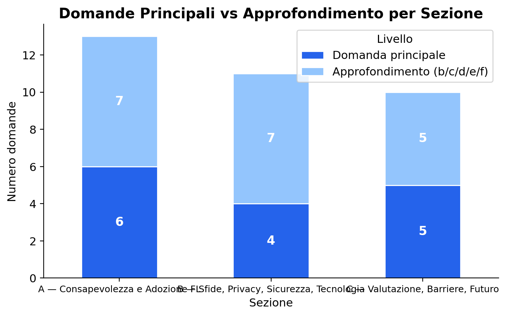

---

## 10. Struttura Completa del Questionario

Tabella riepilogativa di tutte le 34 domande con sezione, tema, obbligatorietà e tipologia di risposta.

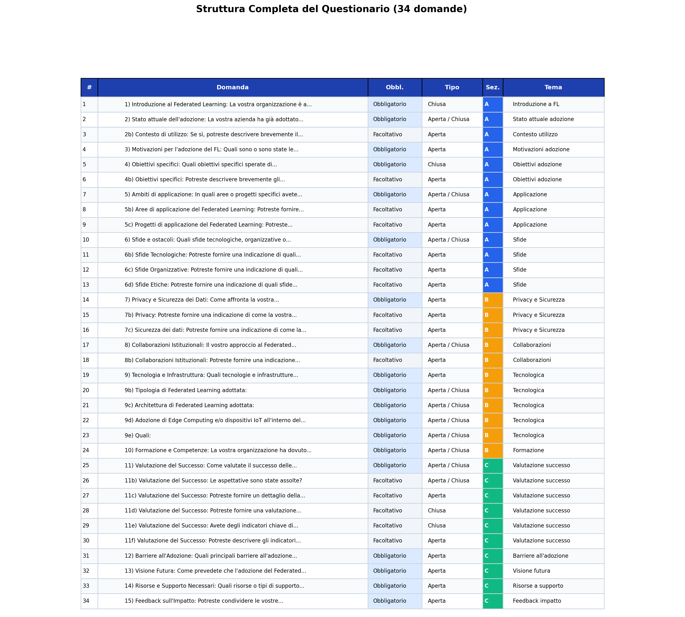

---

## Considerazioni sulla Struttura

- **Bilanciamento sezioni:** le 3 sezioni hanno un numero comparabile di domande (13, 11, 10), garantendo una copertura equilibrata
- **Approccio a imbuto:** ogni tema principale è seguito da domande di approfondimento facoltative, permettendo risposte rapide (solo obbligatorie, ~15 min) o dettagliate (tutte, ~30 min)
- **Mix di tipologie:** la combinazione di domande aperte (esplorative) e chiuse (quantificabili) consente sia analisi qualitative che quantitative
- **Copertura tematica ampia:** 16 temi coprono l'intero spettro dall'awareness iniziale alla visione futura, passando per sfide, tecnologia, privacy e valutazione
- **Focus su tecnologia e valutazione:** i temi con più domande (Tecnologica: 5, Valutazione successo: 6) riflettono le priorità della ricerca

---

[← Torna al README principale](README.md)
