# Pre-Analytics — Dashboard Adozione FL negli Ospedali Italiani

**Dashboard Power BI per l'analisi del database degli ospedali italiani e del campione selezionato per l'indagine sull'adozione del Federated Learning**

> Sono state sviluppate due versioni della dashboard (v1 e v2), con progressivo arricchimento dei dati e delle visualizzazioni. La v2 integra il database completo del Ministero della Salute (1.390 strutture) con la struttura del questionario.

---

# Dashboard v1 — Adozione FL negli Ospedali Italiani

**Versione 0.1** — Data rilascio: 27/03/2024

Dashboard iniziale basata sul campione di **31 ospedali** selezionati, con 4 schede tematiche.

---

## v1 — 1. Generale

Scheda introduttiva con il contesto del progetto: analisi dell'adozione del FL negli Ospedali Italiani rispetto a tipologia adottata (Centralizzato, Decentralizzato, Ibrido), architettura (on premises, in Cloud) e competenze fruite (fornitore esterno, sviluppo legacy).

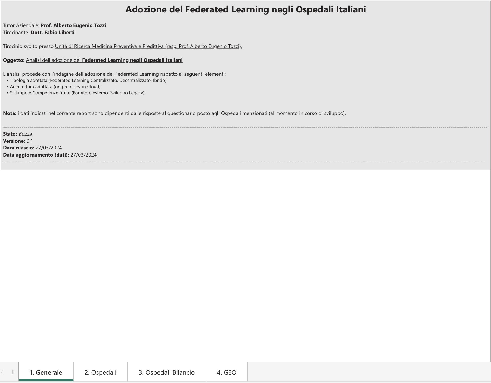

---

## v1 — 2. Ospedali

Catalogo dei **31 ospedali** del campione, con filtri interattivi per:
- **Tipologia:** Pubblico (87,1%) vs Privato (12,9%)
- **Pediatrico:** Si (45,16%), No (41,94%), Non classificato (12,9%)
- **IRCCS:** Si / No
- **Posti letto:** da 50 a 1.600
- **Macroregione:** Nord, Centro, Sud
- **Bilancio annuale**

La tabella dettaglia ogni struttura con città, stato pediatrico, IRCCS, tipologia, posti letto, bilancio e macroregione.

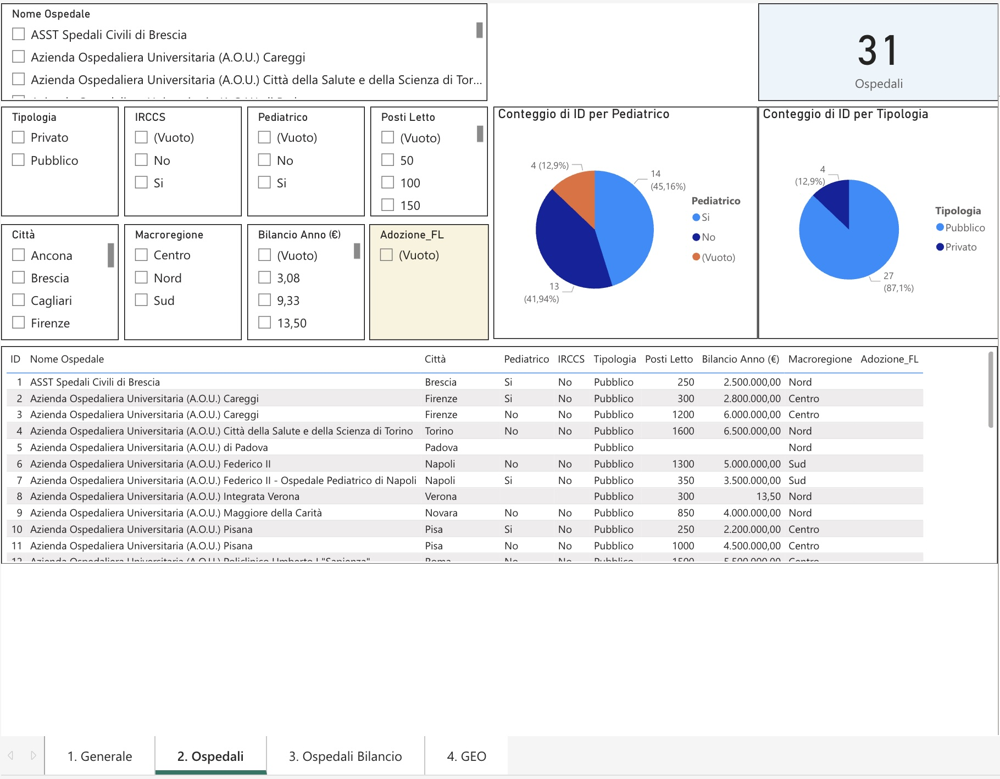

---

## v1 — 3. Ospedali Bilancio

Analisi economica del campione per macroregione:
- **Centro:** ~1,24 Mld di bilancio annuale complessivo
- **Nord:** ~1,16 Mld
- **Sud:** ~0,01 Mld

Il grafico a linea mostra la distribuzione del bilancio per singolo ospedale, evidenziando la forte variabilità dimensionale del campione.

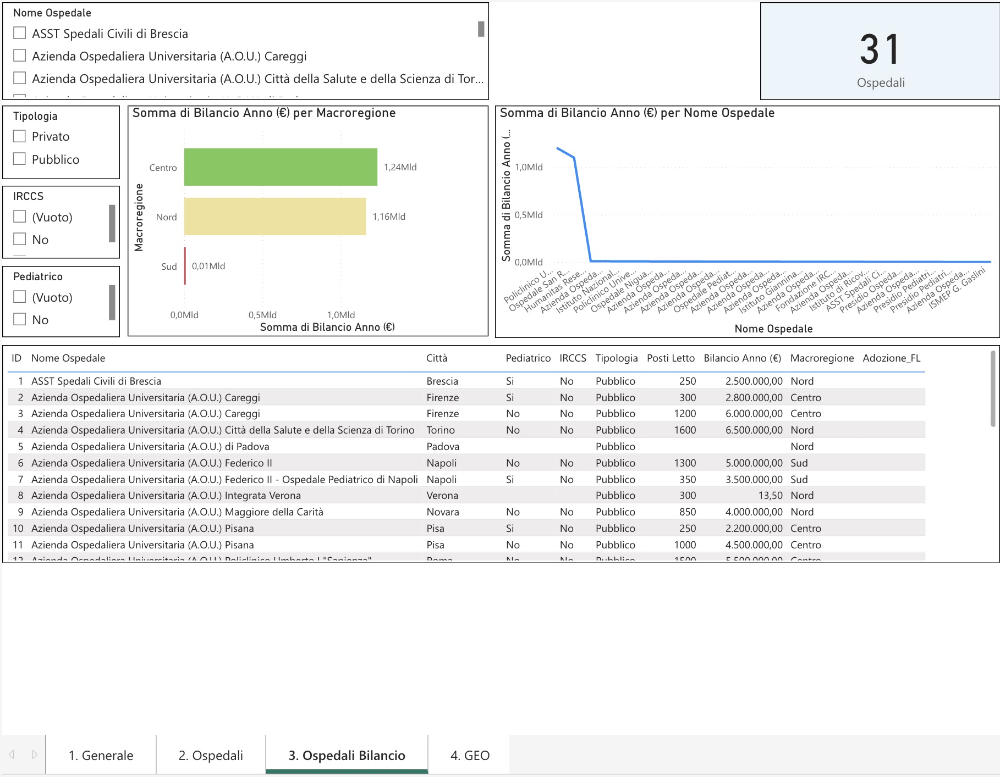

---

## v1 — 4. GEO — Geolocalizzazione

Mappa geografica interattiva dei 31 ospedali del campione, geolocalizzati per città. La dimensione dei punti riflette il numero di strutture per località. Si osserva una concentrazione nelle aree metropolitane di **Milano**, **Roma**, **Firenze** e **Torino**.

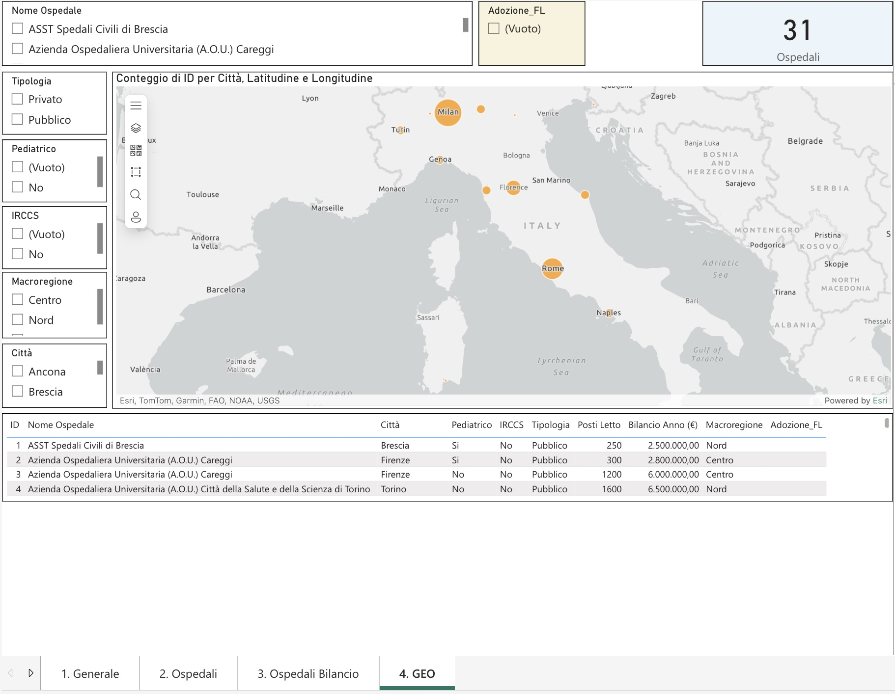

---

---

# Dashboard v2 — Adozione FL negli Ospedali Italiani (Aggiornata)

**Versione 0.2** — Data rilascio: 15/04/2024

Dashboard evoluta che integra il database completo del **Ministero della Salute** (1.390 strutture di ricovero pubbliche e private, aggiornate al 01/03/2023) con la struttura del questionario. Composta da 7 schede.

---

## v2 — 0. Info

Scheda informativa con i metadati del progetto e la fonte dati ufficiale:
- **Fonte:** Elenco "Aziende sanitarie locali e Strutture di ricovero" — Ministero della Salute
- **Dati aggiornati al:** 01/03/2023
- **A cura di:** Direzione generale della digitalizzazione, sistema informativo sanitario e della statistica (NSIS)
- **Periodo di riferimento:** 2010–2024
- **Contatti fonte:** Fulvio Basili, f.basili@sanita.it

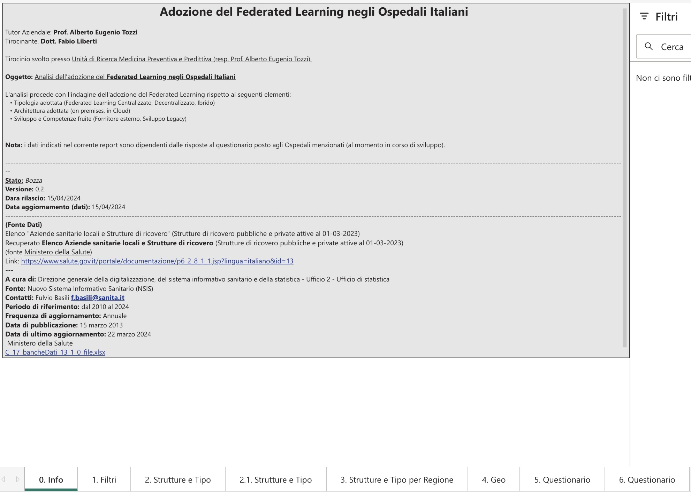

---

## v2 — 1. Filtri

Pannello filtri con KPI di sintesi del database nazionale:

| KPI | Valore |
|-----|--------|
| Regioni | 22 |
| Comuni | 595 |
| Tipi di struttura | 15 |
| Strutture interne | 396 |
| Strutture totali | 1.390 |

Filtri disponibili per: Regione, Comune, Tipo Struttura, Denominazione struttura (interna e esterna).

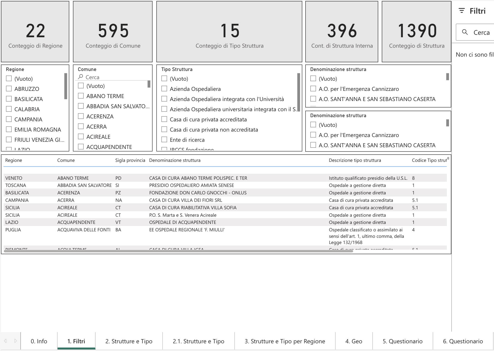

---

## v2 — 2. Strutture e Tipo

Distribuzione delle 1.390 strutture per tipologia. Le categorie principali:

| Tipo struttura | Conteggio |
|----------------|-----------|
| Ospedale a gestione diretta | 585 |
| Casa di cura privata accreditata | 493 |
| Casa di cura privata non accreditata | 63 |
| IRCCS privato | 41 |
| IRCCS pubblico | 31 |
| Ospedale classificato o assimilato | 28 |
| Azienda Ospedaliero-Universitaria | 14 |
| Azienda Ospedaliera integrata con l'Università | 28 |
| Azienda Ospedaliera | 73 |
| Istituto qualificato presidio USL | 16 |
| IRCCS fondazione | 12 |
| Ente di ricerca | 3 |
| Policlinico universitario privato | 2 |
| Nuova struttura ospedaliera | 1 |

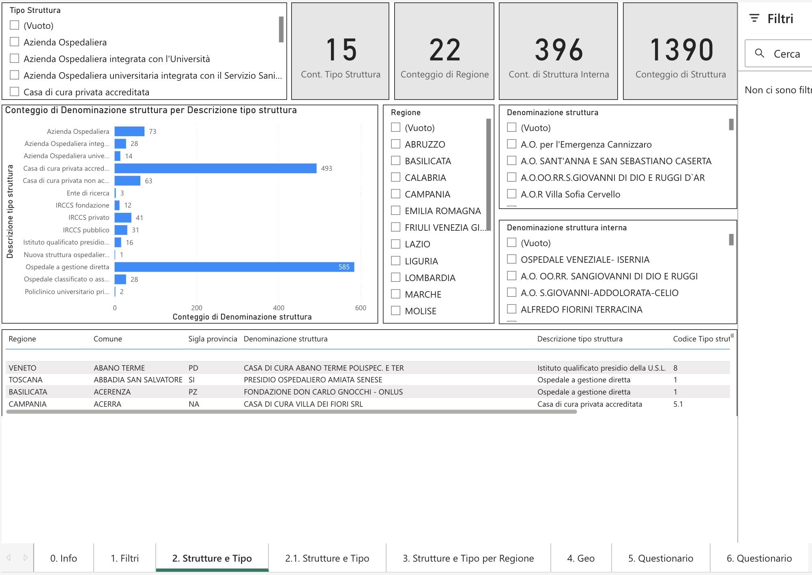

---

## v2 — 2.1 Strutture e Tipo (Pie Chart)

Visualizzazione a torta della stessa distribuzione, che evidenzia come gli **Ospedali a gestione diretta** (42,09%) e le **Case di cura private accreditate** (35,47%) rappresentino insieme il 77,5% del totale delle strutture italiane.

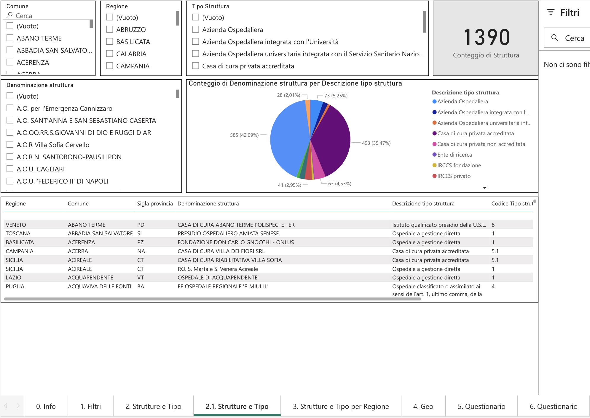

---

## v2 — 3. Strutture e Tipo per Regione

Analisi della distribuzione regionale con doppio grafico:
- **Conteggio Tipo Struttura per Regione:** numero di tipologie diverse presenti in ogni regione (Lazio: 11, Campania: 9, Emilia Romagna: 7, Lombardia: 8, ...)
- **Conteggio Denominazione Struttura per Regione:** numero totale di strutture per regione (Lombardia: 209, Lazio: 141, Campania: 107, Emilia Romagna: 70, ...)

La Lombardia è la regione con il maggior numero assoluto di strutture, mentre il Lazio ha la maggiore diversità tipologica.

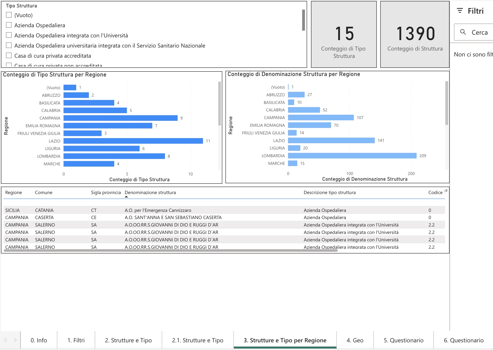

---

## v2 — 4. GEO — Geolocalizzazione

Mappa geolocalizzata delle strutture sanitarie italiane filtrata per le regioni del campione. Mostra **204 strutture** con la distribuzione per comune, tipo struttura e regione. La dimensione dei punti riflette la concentrazione di strutture per area geografica.

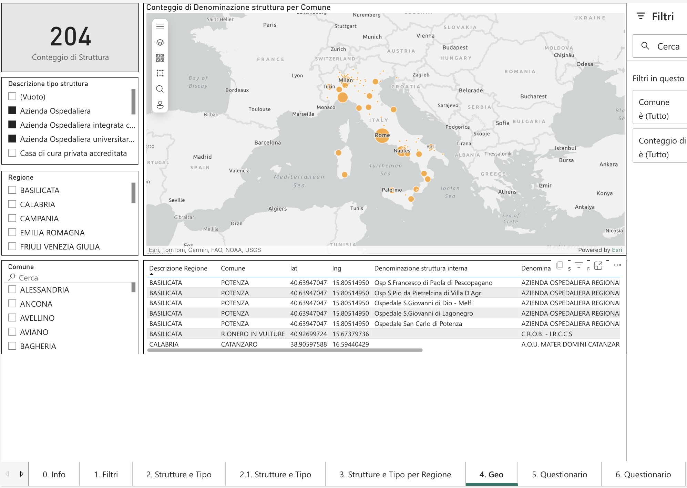

---

## v2 — 5. Questionario (Filtro Sezione)

Integrazione della struttura del questionario nella dashboard, con visualizzazione filtrata per sezione. In questo esempio è attivo un filtro che mostra **9 domande** relative a temi specifici (Applicazione, Collaborazioni, Contesto utilizzo). I grafici a torta mostrano la distribuzione obbligatorio/facoltativo (55,56% / 44,44%) e il tipo di risposta (Aperta 66,67%, Aperta/Chiusa 33,33%).

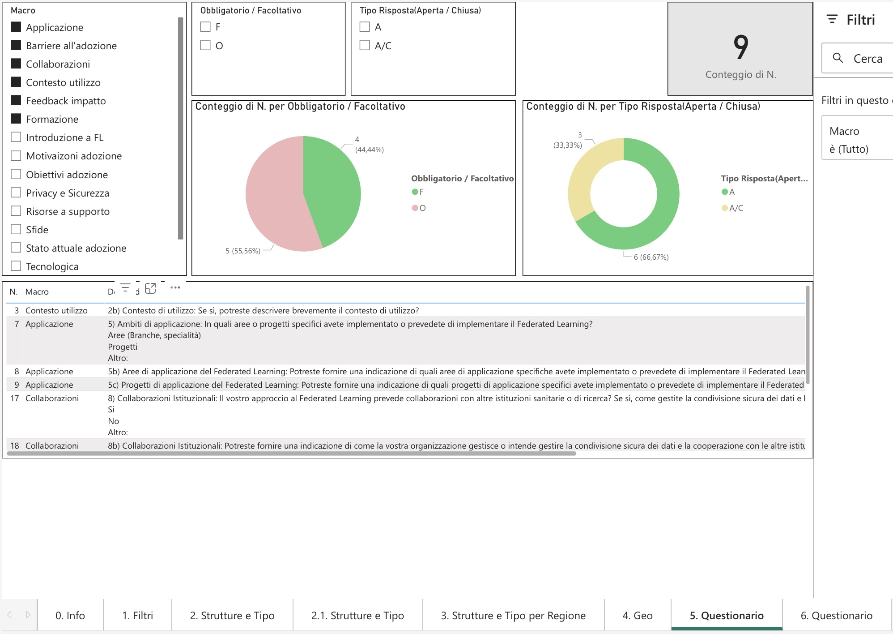

---

## v2 — 6. Questionario (Visione Completa)

Visione completa delle **34 domande** del questionario con:
- **Distribuzione per tipo risposta:** Aperta (19), Aperta/Chiusa (11), Chiusa (4)
- **Distribuzione per macro-tema:** Valutazione successo (6), Tecnologica (5), Sfide (4), Applicazione (3), Privacy e Sicurezza (3), Collaborazioni (2), Obiettivi adozione (2), e 9 temi con 1 domanda ciascuno

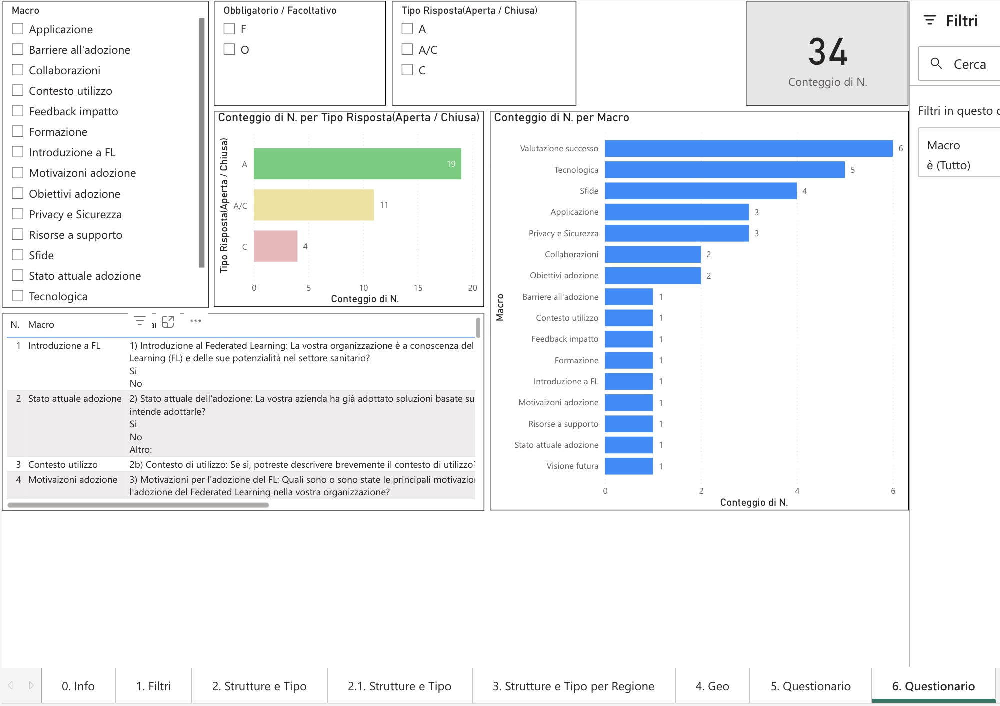

---

## Evoluzione tra v1 e v2

| Aspetto | v1 | v2 |
|---------|----|----|
| **Strutture analizzate** | 31 (campione) | 1.390 (database nazionale) |
| **Fonte dati** | Selezione manuale | Ministero della Salute (NSIS) |
| **Schede** | 4 | 7 |
| **Filtri** | Base (tipologia, IRCCS, pediatrico) | Avanzati (regione, comune, tipo, denominazione) |
| **Questionario** | Non incluso | Integrato (schede 5 e 6) |
| **Analisi economica** | Presente (bilancio) | Rimossa (focus su struttura) |
| **Geolocalizzazione** | 31 ospedali campione | 204+ strutture per area |

---

## Note

- **Strumento:** Microsoft Power BI
- **Fonte dati v2:** Ministero della Salute — Elenco Aziende sanitarie locali e Strutture di ricovero (pubbliche e private attive al 01/03/2023)
- Le dashboard sono state sviluppate come strumento esplorativo a supporto della definizione del campione e della strategia di distribuzione del questionario

---

[← Torna al README principale](README.md)
