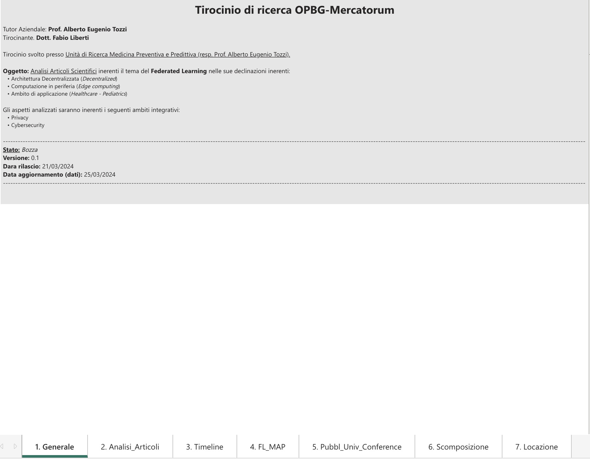
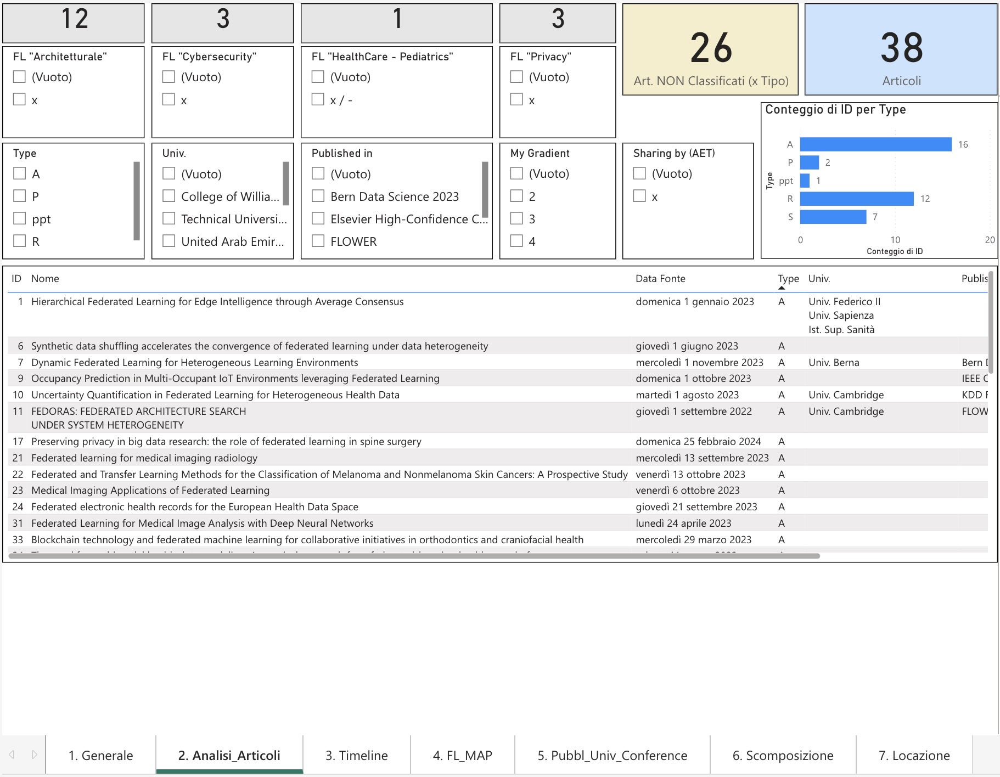
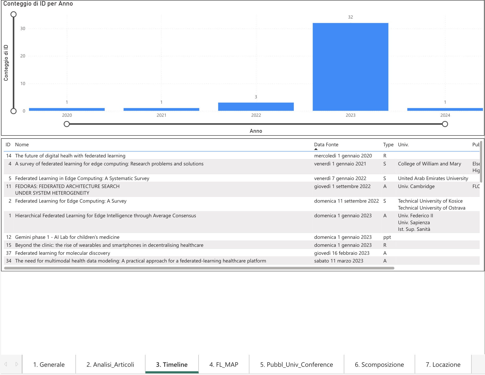
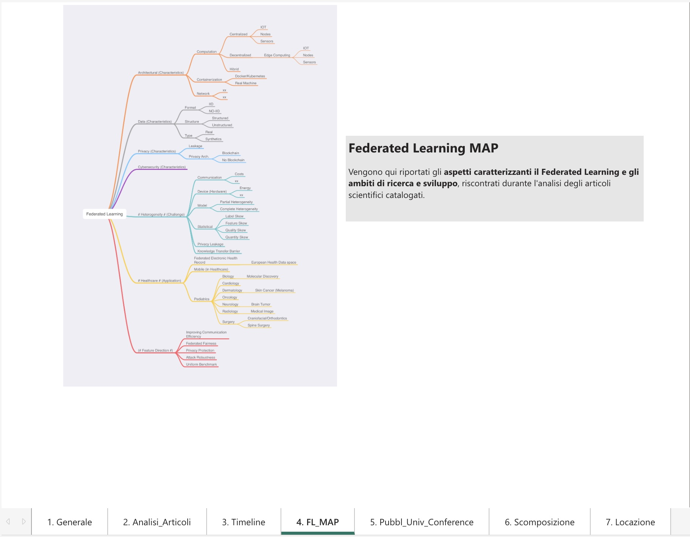
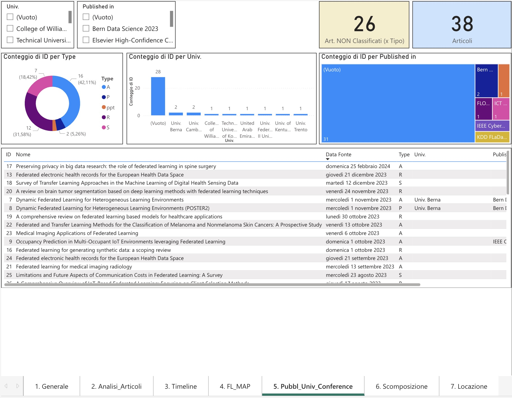
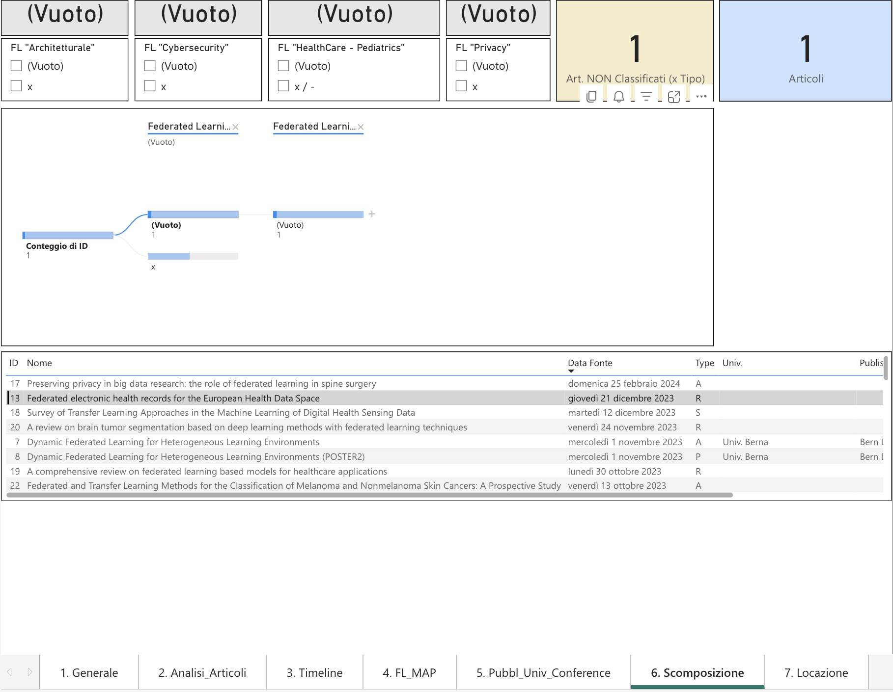
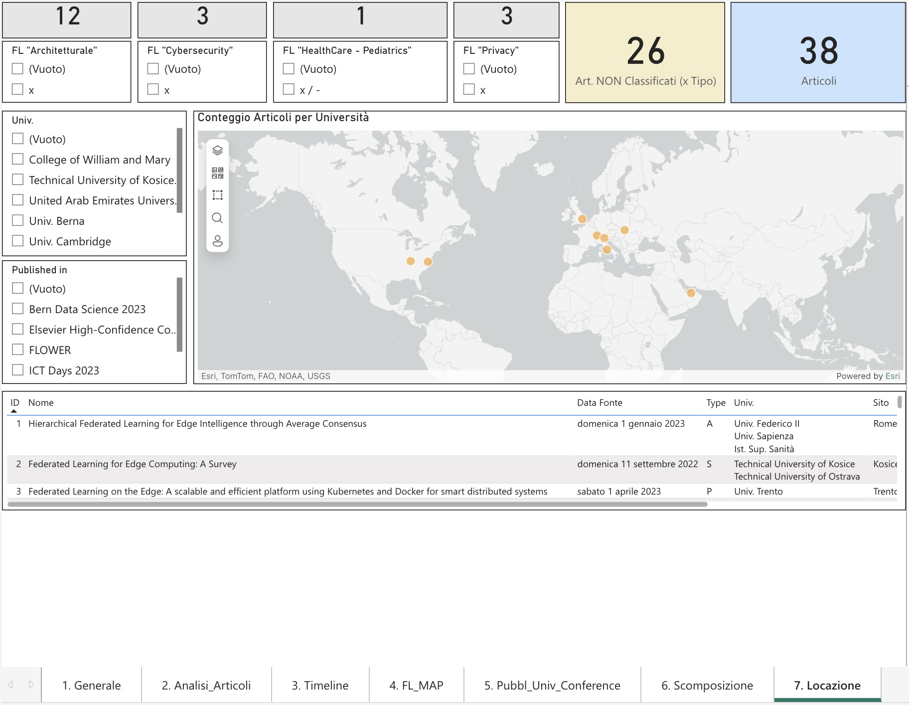

# Pre-Analytics — Dashboard Analisi Articoli Scientifici

**Dashboard Power BI per l'analisi dei 38 articoli scientifici peer-reviewed sulla tematica del Federated Learning in ambito sanitario**

> Questa dashboard è stata realizzata come strumento di analisi a supporto della Systematic Literature Review (SLR) condotta con metodologia PRISMA. Fornisce una visione interattiva e multidimensionale del corpus di articoli catalogati.

---

## Struttura della Dashboard

La dashboard è composta da **7 schede** tematiche:

| Scheda | Contenuto |
|--------|-----------|
| 1. Generale | Informazioni progetto, ambito di analisi, versione |
| 2. Analisi Articoli | Catalogo articoli con filtri per tipo, classificazione FL e università |
| 3. Timeline | Distribuzione temporale delle pubblicazioni per anno |
| 4. FL Map | Mappa concettuale del Federated Learning emersa dall'analisi |
| 5. Pubblicazioni, Università, Conference | Analisi per università, rivista/conferenza e tipologia |
| 6. Scomposizione | Scomposizione degli articoli per dimensioni FL |
| 7. Locazione | Geolocalizzazione delle università autrici |

---

## 1. Generale

Scheda introduttiva del progetto di ricerca. Riporta il contesto accademico (Tirocinio OPBG-Mercatorum), il tutor aziendale (Prof. Alberto Eugenio Tozzi), l'oggetto dell'analisi e le dimensioni investigate: architettura decentralizzata, edge computing, ambito Healthcare/Pediatrics, privacy e cybersecurity.

---

## 2. Analisi Articoli

Catalogo completo dei **38 articoli** analizzati, con filtri interattivi per:
- **Classificazione FL:** Architetturale (12), Cybersecurity (3), HealthCare/Pediatrics (1), Privacy (3)
- **26 articoli** non ancora classificati per tipo specifico
- **Tipologia pubblicazione (Type):** Article (16), Review (12), Survey (7), Poster (2), PPT (1)

La tabella elenca ogni articolo con ID, titolo, data di pubblicazione, tipo, università e rivista/conferenza.

---

## 3. Timeline

Distribuzione temporale delle pubblicazioni per anno. Il grafico evidenzia una forte concentrazione nel **2023** con **32 articoli** (84% del totale), confermando il carattere recente e in rapida crescita della letteratura sul Federated Learning in sanità.

| Anno | Articoli |
|------|----------|
| 2020 | 1 |
| 2021 | 1 |
| 2022 | 3 |
| 2023 | 32 |
| 2024 | 1 |

---

## 4. FL Map — Mappa Concettuale del Federated Learning

Mappa concettuale che sintetizza gli aspetti caratterizzanti il FL e gli ambiti di ricerca/sviluppo emersi dall'analisi degli articoli. Le dimensioni principali includono:

- **Architectural Characteristics:** Computation (Centralized/Decentralized), Containerization, Network
- **Data Characteristics:** Format, Structure, Type (Real/Synthetics)
- **Privacy Characteristics:** Leakage, Privacy Architecture (Blockchain/No Blockchain)
- **Cybersecurity Characteristics:** Communication, Device, Model (Heterogeneity)
- **Healthcare Applications:** Biology, Cardiology, Dermatology, Oncology, Neurology, Radiology, Surgery, Pediatrics
- **Feature Direction:** Federated Fairness, Privacy Protection, Attack Robustness, Uniform Benchmark

---

## 5. Pubblicazioni, Università, Conference

Analisi incrociata per università, rivista/conferenza e tipologia di pubblicazione:

- **Distribuzione per tipo:** Article (42,11%), Survey (31,58%), Review (18,42%), Poster (5,26%), PPT (2,63%)
- **Università coinvolte:** Univ. Berna, Univ. Cambridge, College of William and Mary, Technical University (Kosice/Ostrava), United Arab Emirates University, e altre
- **Principali sedi di pubblicazione:** Bern Data Science 2023, FLOWER, IEEE Cyber, KDD FLaDa, ICT Days 2023, Elsevier High-Confidence Computing

---

## 6. Scomposizione

Scheda di analisi della scomposizione degli articoli lungo le dimensioni FL (Architetturale, Cybersecurity, HealthCare, Privacy). Permette di filtrare e isolare gli articoli che trattano specifiche combinazioni di dimensioni.

---

## 7. Locazione — Geolocalizzazione Università

Mappa geografica delle università autrici degli articoli analizzati. La distribuzione è prevalentemente europea, con contributi da:
- **Europa:** Univ. Berna (Svizzera), Univ. Cambridge (UK), Univ. Federico II / Sapienza / Ist. Sup. Sanità (Italia), Technical University Kosice/Ostrava (Slovacchia/Rep. Ceca), Univ. Trento (Italia)
- **Medio Oriente:** United Arab Emirates University
- **Nord America:** College of William and Mary (USA)

---

## Note

- **Stato:** Bozza, Versione 0.1
- **Data rilascio:** 21/03/2024
- **Strumento:** Microsoft Power BI
- **Articoli totali catalogati:** 38 (di cui 42 analizzati nella SLR, inclusi abstract PubMed)

---

[← Torna al README principale](README.md)
