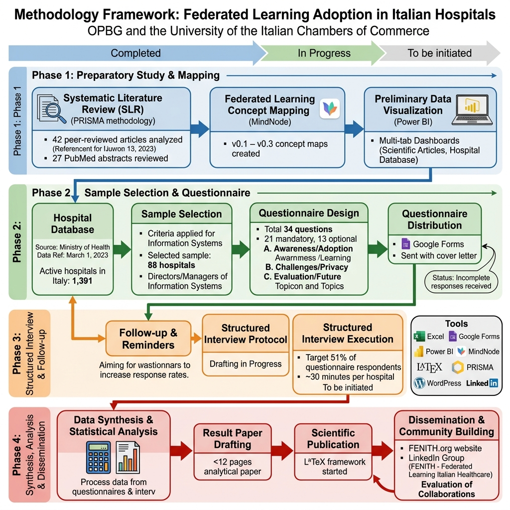
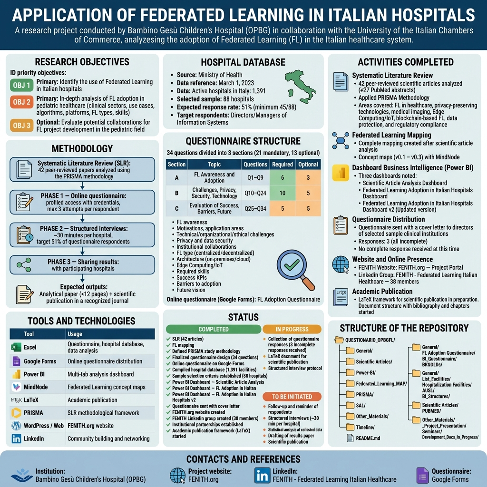

# Questionario di Adozione del Federated Learning negli Ospedali Italiani

**Applicazione del Federated Learning negli Ospedali Italiani**

Progetto di ricerca condotto dall'**Ospedale Pediatrico Bambino Gesù (OPBG)** in collaborazione con l'**Università delle Camere di Commercio Italiane**, finalizzato all'analisi dell'adozione del Federated Learning nel sistema sanitario italiano.

<table>
  <tr>
    <td></td>
    <td></td>
  </tr>
</table>

---

## Obiettivi della Ricerca

| ID | Priorità | Obiettivo |
|----|----------|-----------|
| OBJ 1 | Primario | Identificare l'utilizzo del Federated Learning negli ospedali italiani |
| OBJ 2 | Primario | Analisi approfondita dell'adozione FL nella sanità pediatrica (settori clinici, use case, algoritmi, piattaforme, tipologie FL, competenze) |
| OBJ 3 | Opzionale | Valutare possibili collaborazioni per lo sviluppo di progetti FL in ambito pediatrico |

---

## Research Questions

| RQ | Domanda di Ricerca |
|----|-------------------|
| **RQ1** | Identificare le principali barriere all'adozione del FL nel contesto sanitario italiano |
| **RQ2** | Analizzare il fenomeno della limitata consapevolezza e prioritizzazione del FL |
| **RQ3** | Sviluppare un framework preliminare per guidare l'implementazione del FL nelle strutture sanitarie italiane |
| **RQ4** | Proporre strategie implementative concrete per superare gli ostacoli identificati |
| **RQ5** | Definire una roadmap per l'adozione progressiva del FL nel sistema sanitario nazionale |
| **RQ6** | Presentare iniziative complementari per la promozione del FL in ambito sanitario |

Le Research Questions vengono investigate attraverso il questionario lungo **5 dimensioni di barriere**:

| Dimensione | Aspetti Indagati |
|------------|-----------------|
| **Tecnologiche** | Complessità infrastrutturale, integrazione con sistemi legacy, scalabilità |
| **Organizzative** | Resistenza al cambiamento, mancanza di competenze, processi decisionali complessi |
| **Normative e Compliance** | Complessità GDPR, requisiti privacy, gestione consenso pazienti |
| **Economiche** | Costi di implementazione, incertezza ROI, budget limitati |
| **Culturali** | Consapevolezza limitata del FL, resistenza alla condivisione dati |

---

## Metodologia

- **Systematic Literature Review (SLR):** 42 paper peer-reviewed analizzati con metodologia PRISMA
- **Fase 1 — Questionario online:** accesso profilato con credenziali, max 3 tentativi per rispondente
- **Fase 2 — Interviste strutturate:** ~30 minuti per ospedale, target 51% dei rispondenti al questionario
- **Fase 3 — Condivisione risultati:** con gli ospedali partecipanti
- **Output previsti:** paper di analisi (<12 pagine) + pubblicazione scientifica su rivista riconosciuta

---

## Struttura del Questionario

**34 domande** suddivise in 3 sezioni (21 obbligatorie, 13 facoltative):

| Sezione | Argomento | Domande | Obbligatorie | Facoltative |
|---------|-----------|---------|--------------|-------------|
| **A** | Consapevolezza e Adozione FL | Q1–Q9 | 6 | 3 |
| **B** | Sfide, Privacy, Sicurezza, Tecnologia | Q10–Q24 | 10 | 5 |
| **C** | Valutazione Successo, Barriere, Futuro | Q25–Q34 | 5 | 5 |

**Temi coperti:** consapevolezza FL, motivazioni all'adozione, aree applicative, sfide tecnologiche/organizzative/etiche, privacy e sicurezza dati, collaborazioni istituzionali, tipologia FL (centralizzato/decentralizzato), architettura (on-premises/cloud), Edge Computing/IoT, competenze necessarie, KPI di successo, barriere all'adozione, visione futura.

**Questionario online (Google Forms):**
[Questionario Adozione FL](https://docs.google.com/forms/d/1y_ak7EQXsGfmNd825Fk2EYmuklQST-0lUwCvzwhD5NA/viewform?edit_requested=true)

---

## Database Ospedali

| Parametro | Valore |
|-----------|--------|
| Fonte | Ministero della Salute |
| Riferimento dati | 1 marzo 2023 |
| Ospedali attivi in Italia | 1.391 |
| Campione selezionato | 88 ospedali |
| Tasso risposta atteso | 51% (minimo 45/88) |
| Target rispondenti | Direttori/Responsabili Sistemi Informativi |

---

## Attività Completate

### Revisione Sistematica della Letteratura
- 42 articoli scientifici peer-reviewed analizzati (+ 27 abstract PubMed)
- Metodologia PRISMA applicata
- Aree coperte: FL in sanità, privacy-preserving technologies, medical imaging, Edge Computing/IoT, blockchain-based FL, data protection e compliance normativa

### Mappatura del Federated Learning
- Mappatura completa del Federated Learning realizzata a seguito dell'analisi degli articoli scientifici
- Mappe concettuali prodotte in più versioni (v0.1 – v0.3) con MindNode

### Dashboard di Business Intelligence (Power BI)

Sono state realizzate le seguenti dashboard multischeda:

1. **Dashboard Analisi Articoli Scientifici** — Visualizzazione e analisi dei 42 paper della revisione sistematica
2. **Dashboard Adozione del Federated Learning negli Ospedali Italiani** — Analisi del database ospedali e del campione selezionato
3. **Dashboard Adozione del Federated Learning negli Ospedali Italiani v2** — Versione aggiornata con analisi avanzate

### Distribuzione del Questionario
- Questionario inviato con lettera di accompagnamento ai direttori di istituti clinici del campione selezionato
- **Risposte ricevute: 3** (tutte incomplete)
- Nessuna risposta completa ottenuta al momento

### Sito Web e Presenza Online

- **Sito web FENITH:** [FENITH.org](https://fenith.org) — Portale del progetto
- **Gruppo LinkedIn:** [FENITH - Federated Learning Italian Healthcare](https://www.linkedin.com/groups/10024023/) — Gruppo pubblico, 38 membri

### Pubblicazione Accademica
- Framework LaTeX per pubblicazione scientifica in preparazione
- Struttura documento con bibliografia e capitoli avviata

---

## Struttura del Repository

```
QUESTIONARIO_OPBGFL/
├── General/
│   ├── Questionario Adozione FL/       # Questionario (Excel, v0.1–v0.3+)
│   │   ├── BI_Questionario/            # Dashboard Power BI questionario
│   │   └── BK&OLDs/                    # Backup versioni precedenti
│   ├── Articoli Scientifici/           # 42 paper PDF
│   │   └── PUBMED/                     # 27 abstract PubMed
│   ├── Elenco_Strutture/              # Database ospedali (Min. Salute)
│   │   ├── Strutture di Ricovero/      # Liste strutture ospedaliere
│   │   ├── AUSL/                       # Strutture ASL
│   │   └── BI_Strutture/              # Dashboard Power BI strutture
│   ├── POWER-BI/                       # Dashboard analisi articoli
│   ├── Federated_Learning_MAP/         # Mappe concettuali FL (MindNode)
│   ├── PRISMA/                         # Metodologia SLR PRISMA
│   ├── SAL/                            # Stato avanzamento lavori
│   ├── Altro_Materiale/               # Presentazioni, seminari, documenti
│   │   ├── _Presentazione_Progetto/    # Slide progetto
│   │   ├── Seminari/                   # FLEDGE2024 Stanford
│   │   └── Sviluppo_Docs_In_corso/    # Documenti in lavorazione
│   └── Timeline/                       # Calendario progetto
└── README.md
```

---

## Strumenti e Tecnologie

| Strumento | Utilizzo |
|-----------|----------|
| Excel | Questionario, database ospedali, analisi dati |
| Google Forms | Distribuzione online del questionario |
| Power BI | Dashboard multischeda di analisi |
| MindNode | Mappe concettuali Federated Learning |
| LaTeX | Pubblicazione accademica |
| PRISMA | Framework metodologico SLR |
| WordPress / Web | Sito FENITH.org |
| LinkedIn | Community building e networking |

---

## Stato di Avanzamento

### Completato
- [x] Revisione sistematica della letteratura (42 articoli)
- [x] Mappatura del Federated Learning
- [x] Metodologia dello studio definita (PRISMA)
- [x] Design del questionario finalizzato (34 domande, 3 sezioni)
- [x] Questionario online su Google Forms
- [x] Database ospedali compilato (1.391 strutture)
- [x] Criteri selezione campione stabiliti (88 ospedali)
- [x] Dashboard Power BI — Analisi Articoli Scientifici
- [x] Dashboard Power BI — Adozione FL negli Ospedali Italiani
- [x] Dashboard Power BI — Adozione FL negli Ospedali Italiani v2
- [x] Invio questionario con lettera di accompagnamento ai direttori
- [x] Creazione sito FENITH.org
- [x] Creazione gruppo LinkedIn FENITH (38 membri)
- [x] Partnership istituzionali avviate
- [x] Framework pubblicazione accademica (LaTeX) iniziato

### In Corso
- [ ] Raccolta risposte al questionario (3 risposte incomplete ricevute)
- [ ] Documento LaTeX per pubblicazione scientifica
- [ ] Protocollo interviste strutturate

### Da Avviare
- [ ] Follow-up e sollecito rispondenti
- [ ] Interviste strutturate (~30 min per ospedale)
- [ ] Analisi statistica dei dati raccolti
- [ ] Stesura paper dei risultati
- [ ] Pubblicazione scientifica

---

## Contatti e Riferimenti

- **Istituzione:** Ospedale Pediatrico Bambino Gesù (OPBG)
- **Sito progetto:** [FENITH.org](https://fenith.org)
- **LinkedIn:** [FENITH - Federated Learning Italian Healthcare](https://www.linkedin.com/groups/10024023/)
- **Questionario:** [Google Forms](https://docs.google.com/forms/d/1y_ak7EQXsGfmNd825Fk2EYmuklQST-0lUwCvzwhD5NA/viewform?edit_requested=true)
